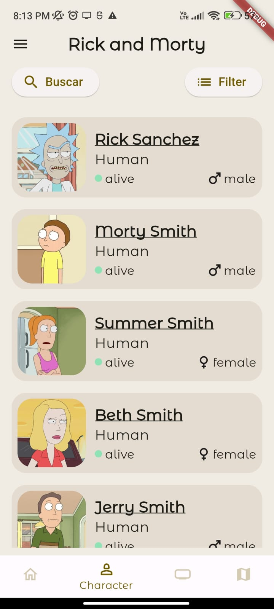

# rick_and_morty

En este proyecto hay:

- Flutter_bloc (Manejador del estado de la app)
- GoRouter (Encargasdo del esrutamiento de la app)
- dio (Peticiones HTTP)
- equatable (Facilita la comparación eficiente de objetos personalizados en Dart)
- shared_preferences: Para lamacenar valores en memoria
  y entre otros

# Lo que contiene

1. Una vista inicial que es donde se tendrá el primer contacto (Login) => puede ingresar con cualquier correo y lo mismo la contraseña.
    
   
    
2. la vista del home solo contiene información quemada para poder mostrar algo en la pantalla
    
   
    
3. en la pantalla de los characters (personajes) podemos observar los personajes de la serie, donde tenemos un filtro para poder filtrar por personajes específicos y también un buscador donde podemos observar los diferentes personajes que saldrán dependiendo del nombre que se escriba en el input. y en esta misma vista de buscador como en la vista de characters podemos dar tap a un personaje e ir a ver su contenido.
    
   
   
   
   
    
4. también hay otras dos vistas que tienen su respectivo filtro y cada ítem o resultado puede ir a la vista de detalles como en characters
    
   
   
    
5. y por último y no menos importante un drawer para poder “cerrar sesión”
   

# Importante

se debe tener instaslado Flutter para poder correr la app:

- Instalar Android estudio (tal vez tenga que instalar SDK Java-11)
- Instalar Flutter

despues de instalador y configurado:

- ejecutar comando `flutter pub get` para traer paquetes de Flutter o lo necesario del proyecto

- Para correr la App debe conectar un dispositivo Fisico o ya sea un dispositivo virtual (el dispositivo fisico debe tener modo desarrollador y tener activado la depuración por usb)

- para correr la app por vscode debe tener plugins instalados para flutter y dart

- despues de esto es solo presionar f5 o ejecutar el comando `flutter run`

# All views

  
  
  
  
  
  
  
  
  
  

